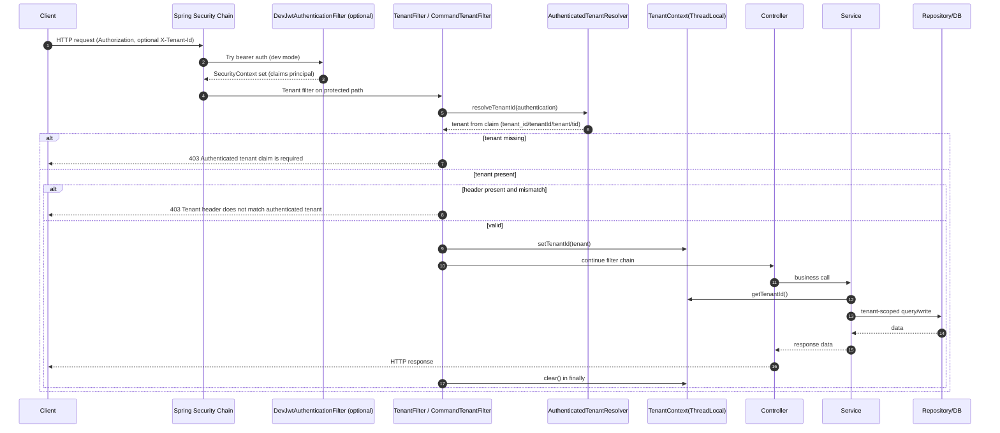

# Filters, Authentication, and Multitenancy Deep-Dive

## Scope
This document explains request entry, authentication flow, tenant resolution, `TenantContext` lifecycle, and tenant isolation in:
- `device-service` (`/api/v1/police/**`, `/api/v1/telemetry/**`)
- `command-service` (`/api/v1/commands/**`)
- shared `common` security classes

---

## 1) Step-by-step request flow

## A. Device-service flow (`/api/v1/police/**`)
1. Request hits Spring Security chain (`SecurityConfig`).
2. Auth is required for `/api/v1/police/**`.
3. If dev JWT mode is enabled, `DevJwtAuthenticationFilter` may authenticate bearer token and set `SecurityContext` principal as JWT claims map.
4. `TenantFilter` runs after `BasicAuthenticationFilter`.
5. `TenantFilter` resolves authenticated tenant from `SecurityContext` via `AuthenticatedTenantResolver`.
6. `TenantFilter` compares optional `X-Tenant-Id` header with authenticated tenant claim:
   - missing header: allowed
   - matching header: allowed
   - mismatched header: rejected (`403`)
7. On success, `TenantFilter` sets `TenantContext` (`ThreadLocal`) and calls controller/service/repository.
8. Controller/service reads tenant from `TenantContext` and issues tenant-scoped queries/writes.
9. `TenantFilter` clears `TenantContext` in `finally` block.

> Note: `TenantFilter` is path-scoped to `/api/v1/police`, so device telemetry publish endpoint `/api/v1/telemetry` is authenticated but not tenant-filtered by this specific filter.

## B. Command-service flow (`/api/v1/commands/**`)
1. Request enters `SecurityConfig`; endpoint requires authentication.
2. Optional `DevJwtAuthenticationFilter` can populate `SecurityContext` from bearer JWT claims.
3. `CommandTenantFilter` executes for `/api/v1/commands/**`.
4. Tenant claim is extracted from authenticated principal via `AuthenticatedTenantResolver`.
5. Header `X-Tenant-Id` is validated against claim (same rules as above).
6. `TenantContext` is set, service executes, and `TenantContext` is cleared in `finally`.
7. Repositories always query by `(tenantId, commandId)` or `(tenantId, commandId)` history ordering, preventing cross-tenant reads.

## C. Shared filters and observability
- `CorrelationIdFilter` (`@Order(HIGHEST_PRECEDENCE)`) sets/generates `X-Correlation-ID`, stores in MDC, echoes header in response, and clears MDC.
- `RequestLoggingFilter` runs next and logs request timing/status.
- Tenant header is added to MDC by `CorrelationIdFilter` if present in request headers.

---

## 2) How tenant is resolved

`AuthenticatedTenantResolver` resolves tenant from authenticated principal using multiple claim keys:
- `tenant_id`
- `tenantId`
- `tenant`
- `tid`

Resolution strategy:
1. Rejects unauthenticated/anonymous authentication.
2. If principal is a `Map`, read claims directly.
3. Else reflectively tries `getClaims()` and `getAttributes()` returning a map.
4. Returns first non-blank recognized tenant claim.

This supports dev JWT map principals and many Spring/OIDC principal types.

---

## 3) Tenant source: header, JWT claim, or both?

**Authoritative source = authenticated identity claim**, not the header.

- JWT/basic-auth derived authentication must exist first.
- Tenant claim is extracted from authenticated principal.
- `X-Tenant-Id` is optional and used as a consistency check only.
- If header exists and differs from token claim -> `403`.

So effectively: **both can appear**, but **claim decides**, header can only confirm.

---

## 4) How `TenantContext` is set and cleared

- Set in `TenantFilter` / `CommandTenantFilter` just before `chain.doFilter(...)`.
- Cleared in `finally` block after downstream execution completes (success or exception).

Pattern (conceptually):
```java
try {
  TenantContext.setTenantId(authenticatedTenant);
  chain.doFilter(req, resp);
} finally {
  TenantContext.clear();
}
```

This guarantees cleanup even on errors.

---

## 5) Why `ThreadLocal` is used

`TenantContext` uses `ThreadLocal<String>` so downstream layers (controller, service, repository, auditing) can access tenant without method-parameter plumbing everywhere.

Benefits:
- Very low friction across layered architecture.
- Works naturally in servlet thread-per-request model.
- Integrates with auditing (`TenantAuditorAware`) and any deep utility code.

Limitations:
- Must be cleared reliably (they do this in `finally`).
- Doesn’t automatically propagate to async threads/executors/reactive pipelines.

---

## 6) How tenant leakage is avoided

Current protections:
1. `TenantContext.clear()` in `finally` avoids stale thread reuse leakage.
2. Repositories and services use tenant-scoped methods (`findByTenantId...`, `findByCommandIdAndTenantId...`).
3. Controllers set entity `tenantId` from `TenantContext` server-side before save.
4. Filters reject mismatched header vs authenticated tenant.

Leak risk still exists if:
- New endpoint bypasses filters/path checks,
- Developer adds non-tenant-scoped repository query,
- Async code accesses `TenantContext` without explicit propagation.

---

## 7) How tenant isolation is enforced

Isolation is app-layer + query-layer based (not DB native RLS):
- Request guard: tenant-aware filters ensure authenticated tenant context.
- Read isolation: repository methods include tenant in predicate.
- Write isolation: services/controllers write `tenantId` from context, not trusting body.
- Command-service indexes include tenant for key lookups and history scans.

This is strong if all code paths follow conventions; weaker than DB Row-Level Security because enforcement is not centralized in DB policy.

---

## 8) Missing or mismatched tenant behavior

### Missing authenticated tenant claim
- `AuthenticatedTenantResolver` returns empty.
- Tenant filters return `403` with message: `Authenticated tenant claim is required`.

### Mismatched `X-Tenant-Id`
- If header exists and differs from authenticated claim, filter returns `403`.

### Missing header but valid claim
- Accepted; claim tenant is used.

### Missing authentication
- Endpoint-level security rejects protected APIs (typically `401` before tenant filter logic can pass).

---

## 9) Security risks in current implementation

1. **Dev JWT filter in service code**
   - Custom JWT validation is okay for local/dev, but risky if accidentally enabled in production.
2. **No strict issuer/audience/key rotation strategy**
   - Dev secrets are static shared HMAC keys from config.
3. **Path-scoped tenant filter in device-service**
   - `TenantFilter` only checks `/api/v1/police/**`; `/api/v1/telemetry` path does not get same tenant-context enforcement.
4. **Application-level tenant isolation only**
   - No DB row-level security; a missed `tenantId` predicate could expose cross-tenant data.
5. **Potential async context gaps**
   - `ThreadLocal` tenant context can be absent in async tasks unless explicitly propagated.
6. **Header-based MDC tenant**
   - `CorrelationIdFilter` logs tenant from raw header (can be spoofed), while authorization uses claim. Log tenant may diverge from true tenant.

---

## 10) Improvements for production

1. Replace custom dev JWT with standard resource-server validation:
   - OAuth2 Resource Server + JWKS, issuer/audience validation, key rotation.
2. Fail closed on profile drift:
   - Explicit startup guard preventing `app.security.jwt.dev.enabled=true` in prod.
3. Centralize tenant enforcement:
   - Apply tenant filter to all tenant-sensitive endpoints (or method security + policy interceptor).
4. Add DB-level defense in depth:
   - PostgreSQL Row-Level Security policies by tenant, or schema-per-tenant strategy.
5. Add global query safeguards:
   - Repository/specification interceptors to enforce tenant predicate automatically.
6. Harden logging trust model:
   - Put authenticated tenant claim into MDC after auth, not just request header.
7. Async propagation strategy:
   - Task decorators or explicit context objects for executors.
8. Stronger authorization model:
   - Include roles/scopes + per-resource authorization, not just authentication+tenant.
9. Threat detection and audit:
   - Metrics/alerts for tenant mismatch 403s, missing-tenant 403 spikes, and suspicious token issuers.
10. Secrets management:
   - Move secrets to vault/KMS, rotate routinely, no inline defaults.

---

## Important classes and methods (quick index)

| Area | Class | Method(s) / concern |
|---|---|---|
| Tenant context | `TenantContext` | `setTenantId`, `getTenantId`, `clear` |
| Tenant extraction | `AuthenticatedTenantResolver` | `resolveTenantId`, claim-key fallback |
| Device tenant filter | `TenantFilter` | path check, claim-vs-header check, set/clear context |
| Command tenant filter | `CommandTenantFilter` | same for `/api/v1/commands/**` |
| Correlation | `CorrelationIdFilter` | correlation id generation/propagation + MDC cleanup |
| Device auth chain | `device...SecurityConfig` | auth rules + filter ordering |
| Command auth chain | `command...SecurityConfig` | auth rules + filter ordering |
| Dev JWT | `DevJwtAuthenticationFilter` (device/command) | bearer parse, HS256 validation, `SecurityContext` set |
| Device controller usage | `PoliceController` | tenant-scoped reads + tenant assignment on writes |
| Command service usage | `CommandService` | `currentTenant()`, tenant-scoped repo calls |
| Tenant-aware repos | `OfficerRepository`, `PatrolVehicleRepository`, `IncidentRepository`, `CommandRepository`, `CommandStatusHistoryRepository` | `...ByTenantId...` queries |

---

## Mermaid sequence diagram



---

## Interview explanation script (2-3 minutes)

"This repo uses a shared multitenancy pattern built around security-authenticated tenant claims and a `ThreadLocal` `TenantContext`. Request authentication happens first via Spring Security, and in dev mode a custom JWT filter can parse bearer claims into the `SecurityContext`. Then a tenant filter (`TenantFilter` in device-service, `CommandTenantFilter` in command-service) extracts tenant from authenticated claims using `AuthenticatedTenantResolver`.

The `X-Tenant-Id` header is optional and used as a guardrail—if present, it must match the authenticated tenant claim, otherwise the request is rejected with 403. On success, tenant is set into `TenantContext` before controller/service execution and always cleared in `finally`, preventing thread reuse leakage.

Isolation is enforced by tenant-scoped repository methods and server-side assignment of tenantId during writes. This is strong convention-based isolation, but for production I’d add DB row-level security and standardized OAuth2/JWKS token validation to reduce reliance on app-layer discipline and dev-style JWT logic." 

---

## Deep interview Q&A (with tradeoffs)

### Q1) Why not trust `X-Tenant-Id` directly?
**Answer:** Headers are client-controlled and spoofable. This code trusts authenticated claims and only uses header as consistency check.
**Tradeoff:** Better security, but harder cross-tenant admin workflows without explicit impersonation model.

### Q2) Why use `ThreadLocal` instead of passing tenant everywhere?
**Answer:** Cleaner method signatures and easier retrofit across layers.
**Tradeoff:** Context propagation complexity for async/reactive code.

### Q3) Is app-layer tenant filtering enough?
**Answer:** It works if every query is scoped.
**Tradeoff:** Human error risk; DB RLS gives stronger centralized guarantees.

### Q4) What happens on thread reuse in servlet containers?
**Answer:** If context isn’t cleared, one tenant could leak into another request.
**Mitigation in repo:** `clear()` in `finally`.

### Q5) Why validate header-vs-claim mismatch?
**Answer:** Prevents confused-deputy behavior and catches client bugs.
**Tradeoff:** Slightly stricter API behavior for legacy clients.

### Q6) What’s risky about custom JWT parsing?
**Answer:** Easy to miss standards checks (aud, nbf, kid rotation, alg pitfalls).
**Tradeoff:** Simpler local setup vs weaker production assurance.

### Q7) How would you support service-to-service calls?
**Answer:** Use signed service tokens with tenant delegation claim and explicit allowed-tenants policy.
**Tradeoff:** More complexity in IAM and auditing.

### Q8) Could logs show wrong tenant?
**Answer:** Yes, because MDC tenant currently can come from raw header in `CorrelationIdFilter`.
**Improvement:** overwrite MDC tenant from authenticated claim post-auth.

### Q9) How does idempotency relate to multitenancy?
**Answer:** Idempotency keys are partitioned by tenant in storage to avoid cross-tenant key collisions.
**Tradeoff:** More index/storage cardinality.

### Q10) What is the minimum production hardening plan?
**Answer:** Standard JWT validation (JWKS), DB RLS, global tenant query guardrails, async context propagation, and security telemetry for tenant errors.
