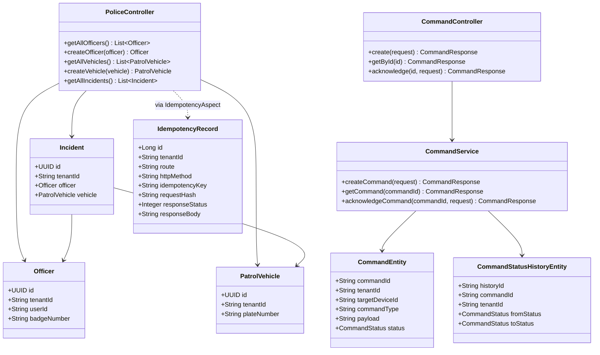
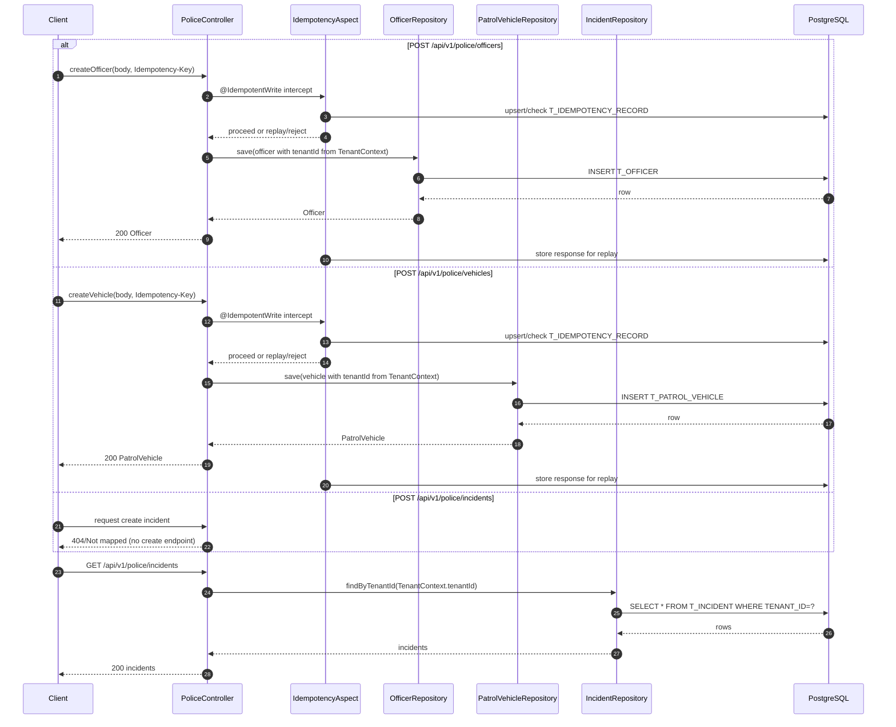

# REST API and Database Flow (Interview Guide)

## Scope
This covers REST + persistence flow across services, with emphasis on PostgreSQL-backed paths (`device-service`, `command-service`) and how they interact with controllers, services, repositories, entities, DTOs, and Flyway migrations.

---

## 1) API summary table

| Service | Endpoint | Method | Main classes | Persistence backend | Notes |
|---|---|---|---|---|---|
| device-service | `/api/v1/police/officers` | GET | `PoliceController#getAllOfficers` → `OfficerRepository#findByTenantId` | PostgreSQL (`T_OFFICER`) | Tenant-scoped read |
| device-service | `/api/v1/police/officers` | POST | `PoliceController#createOfficer` + `@IdempotentWrite` | PostgreSQL (`T_OFFICER`, `T_IDEMPOTENCY_RECORD`) | Tenant forced from `TenantContext`; idempotency enforced |
| device-service | `/api/v1/police/vehicles` | GET | `PoliceController#getAllVehicles` → `PatrolVehicleRepository#findByTenantId` | PostgreSQL (`T_PATROL_VEHICLE`) | Tenant-scoped read |
| device-service | `/api/v1/police/vehicles` | POST | `PoliceController#createVehicle` + `@IdempotentWrite` | PostgreSQL (`T_PATROL_VEHICLE`, `T_IDEMPOTENCY_RECORD`) | Same idempotency flow as officer create |
| device-service | `/api/v1/police/incidents` | GET | `PoliceController#getAllIncidents` → `IncidentRepository#findByTenantId` | PostgreSQL (`T_INCIDENT`) | Read-only API currently |
| device-service | `/api/v1/telemetry` | POST | `TelemetryPublishController` → `TelemetryPublishService` | Kafka topic (`police-telemetry`) | Not persisted in PostgreSQL by this endpoint |
| command-service | `/api/v1/commands` | POST | `CommandController#create` → `CommandService#createCommand` | PostgreSQL (`device_commands`, `command_status_history`) | Uses DTO request/response and history append |
| command-service | `/api/v1/commands/{id}` | GET | `CommandController#getById` → `CommandService#getCommand` | PostgreSQL (`device_commands`, `command_status_history`) | Tenant + command lookup |
| command-service | `/api/v1/commands/{id}/acks` | POST | `CommandController#acknowledge` → `CommandService#acknowledgeCommand` | PostgreSQL (`device_commands`, `command_status_history`) | Transition validation + history append |
| event-service | `/api/v1/telemetry/device/{deviceId}`, `/all`, `/count` | GET | `TelemetryController` → `TelemetrySnapshotService` | Redis | Included for API completeness; not PostgreSQL |

---

## 2) Request/response flow by major API

## A) Create Officer (`POST /api/v1/police/officers`)
1. `PoliceController#createOfficer(@RequestBody Officer)` receives entity-shaped payload.
2. `@IdempotentWrite` triggers `IdempotencyAspect.enforceIdempotency()`:
   - requires `Idempotency-Key` header,
   - scopes record by `(tenantId, route, method, idempotencyKey)`,
   - rejects same key with different payload (`409`),
   - replays prior response for exact duplicate.
3. Controller sets `officer.tenantId` from `TenantContext` (not trusted from input body).
4. `OfficerRepository.save(officer)` writes row into `T_OFFICER`.
5. Response body is persisted in `T_IDEMPOTENCY_RECORD` for replay.
6. Returns persisted `Officer` JSON.

## B) Create Vehicle (`POST /api/v1/police/vehicles`)
Same pattern as officer create:
- idempotency gate,
- tenant injection from `TenantContext`,
- `PatrolVehicleRepository.save(vehicle)` into `T_PATROL_VEHICLE`,
- cached response for duplicate replay.

## C) Get Incidents (`GET /api/v1/police/incidents`)
- `PoliceController#getAllIncidents()` reads `TenantContext` and calls `IncidentRepository.findByTenantId(tenantId)`.
- Returns tenant-filtered incident list from `T_INCIDENT`.
- There is currently **no REST create incident endpoint**; incidents are read-only in exposed API.

## D) Create Command (`POST /api/v1/commands`)
1. `CommandController#create(CreateCommandRequest)` receives DTO.
2. `CommandService#createCommand()` (`@Transactional`) validates required fields.
3. Builds `CommandEntity` with tenant from `TenantContext`, sets status `CREATED`, saves to `device_commands`.
4. Adds history row (`from=null`, `to=CREATED`) in `command_status_history`.
5. Performs internal transition to `SENT` and appends second history row.
6. Returns `CommandResponse` DTO with command details + ordered history list.

## E) Acknowledge Command (`POST /api/v1/commands/{id}/acks`)
1. `CommandService#acknowledgeCommand()` loads by `(commandId, tenantId)`.
2. Validates requested status ∈ `{ACKED, FAILED, TIMED_OUT}` and current status is allowed.
3. Updates command status and appends history row in same transaction.
4. Returns full `CommandResponse` DTO.

---

## 3) Entity relationship overview

### Device domain (PostgreSQL)
- `Officer` (`T_OFFICER`): tenant, badge/user identity, status.
- `PatrolVehicle` (`T_PATROL_VEHICLE`): tenant, plate, type/status/location.
- `Incident` (`T_INCIDENT`): tenant + optional FK to officer and vehicle.
- `IdempotencyRecord` (`T_IDEMPOTENCY_RECORD`): dedupe/replay ledger for POST writes.

### Command domain (PostgreSQL)
- `CommandEntity` (`device_commands`): command state, payload, target device, tenant.
- `CommandStatusHistoryEntity` (`command_status_history`): timeline of transitions per command and tenant.

### DTO usage
- Command APIs use DTOs (`CreateCommandRequest`, `CommandAckRequest`, `CommandResponse`, `CommandStatusHistoryResponse`).
- Device police APIs directly use entity classes in request/response (no separate DTO layer).

---

## 4) Mermaid class diagram (API + DB model)

---

## 5) Mermaid sequence diagram (create officer / vehicle / incident)

---

## 6) Validation, error handling, and transactions

### Validation
- `CommandService#validateCreateRequest()` performs required-field checks for command creation.
- Ack endpoint validates legal transition targets and current-state eligibility.
- Device create endpoints rely mostly on DB constraints + idempotency checks; no Bean Validation annotations (`@Valid`, `@NotBlank`) are present on entity request payloads.

### Error handling
- `CommandExceptionHandler`:
  - `CommandNotFoundException` → `404`
  - invalid transition / illegal argument → `400`
- `IdempotencyExceptionHandler`:
  - missing idempotency key → `400`
  - key conflict/in-progress misuse → `409`
- Other runtime DB/security errors fall back to default Spring exception handling.

### Transactions
- `CommandService` public methods are annotated with `@Transactional` (`jakarta.transaction.Transactional`) for create/read/ack flows.
- `IdempotencyAspect#enforceIdempotency()` is `@Transactional` to keep dedupe record + business write/replay state coherent.
- Standard Spring Data repository calls are otherwise transactional per Spring defaults.

---

## 7) PostgreSQL usage in this project

- PostgreSQL is configured for `device-service` and `command-service` via `spring.datasource.*` in `application-dev.yaml`/`application-prod.yaml`.
- Dialect is explicitly PostgreSQL; Flyway is enabled; JPA `ddl-auto=validate` (schema must match migrations).
- Docker Compose provisions Postgres 15 (`postgres:15-alpine`) database `police_db`.
- Migrations define tables/indexes for police entities, idempotency ledger, command tables, and command history.

### Tenant storage model
- Tenant is stored as a plain column (`TENANT_ID`/`tenant_id`) in business tables.
- Isolation is implemented in application query predicates (e.g., `findByTenantId`, `findByCommandIdAndTenantId`) rather than PostgreSQL Row-Level Security.

### Partitioning / sharding
- No native partitioning (`PARTITION BY`) or sharding strategy exists in current SQL/migrations.
- Current scale strategy is index-based filtering by tenant and business keys.

---

## 8) Interview-ready improvements (pros/tradeoffs)

1. **Add Bean Validation DTOs for device APIs**
   - **Pro:** predictable request validation + cleaner 400s.
   - **Tradeoff:** additional mapping layer from DTO ↔ entity.
2. **Introduce DTO layer for officer/vehicle/incident**
   - **Pro:** decouples API contract from persistence schema.
   - **Tradeoff:** extra conversion code and maintenance.
3. **Centralized exception model (`ProblemDetail`)**
   - **Pro:** consistent error responses across services.
   - **Tradeoff:** migration effort for existing clients/tests.
4. **DB Row-Level Security by tenant**
   - **Pro:** stronger defense in depth against accidental unscoped queries.
   - **Tradeoff:** more complex SQL/session tenant context management.
5. **Add optimistic locking/version columns**
   - **Pro:** safer concurrent updates for command state.
   - **Tradeoff:** occasional retries/conflict handling required.
6. **Consider table partitioning for large history/idempotency tables**
   - **Pro:** better long-term retention/performance.
   - **Tradeoff:** operational complexity in PostgreSQL.
7. **Extend incident API with create/update workflows**
   - **Pro:** complete CRUD narrative for interviews.
   - **Tradeoff:** requires validation, authorization, and lifecycle rules.
8. **Surface transaction boundaries explicitly in docs/tests**
   - **Pro:** clearer correctness story in interviews.
   - **Tradeoff:** extra integration test coverage to maintain.

---

## 9) Deep interview Q&A (pros/tradeoffs)

### Q1) Why is tenant in every table instead of separate DB per tenant?
**Answer:** Simpler operations and cross-tenant analytics, with lower infrastructure overhead.
**Tradeoff:** Strict app/query discipline required to prevent tenant data leaks.

### Q2) Why use idempotency table for POST writes?
**Answer:** Prevents duplicate processing/retries creating duplicate officers/vehicles.
**Tradeoff:** Extra write/read overhead and storage growth over time.

### Q3) Why are command APIs DTO-based while device APIs are entity-based?
**Answer:** Command API models lifecycle responses/history explicitly.
**Tradeoff:** Inconsistency across services; entity-based endpoints can leak schema details.

### Q4) Is `@Transactional` on command reads necessary?
**Answer:** It provides consistent read of command + history assembly in same boundary.
**Tradeoff:** Slight transaction overhead for read endpoints.

### Q5) How does command state integrity work?
**Answer:** Transition checks in service limit allowed ack states and source states.
**Tradeoff:** Logic is app-level; DB constraints don’t enforce transition graph.

### Q6) What if controller forgets tenant assignment before save?
**Answer:** Could create unscoped records or violate NOT NULL, depending on entity path.
**Tradeoff:** Manual pattern is fragile; better with centralized persistence guardrails.

### Q7) Why no partitioning right now?
**Answer:** Current model likely optimized for simplicity and moderate data volumes.
**Tradeoff:** Large tables (history/idempotency) may eventually require archival or partitioning.

### Q8) How does Flyway + `ddl-auto=validate` help?
**Answer:** Enforces migration-driven schema ownership and catches schema drift at startup.
**Tradeoff:** Deploys fail fast if migration/state mismatch exists.

### Q9) How are errors exposed to API consumers?
**Answer:** Command/idempotency have targeted handlers; others rely on default Spring behavior.
**Tradeoff:** Inconsistent error envelope across endpoints/services.

### Q10) What’s the minimum production hardening for DB/API layer?
**Answer:** DTO validation, uniform error contract, RLS or tenant enforcement interceptor, and stronger integration tests for multitenant query isolation.
