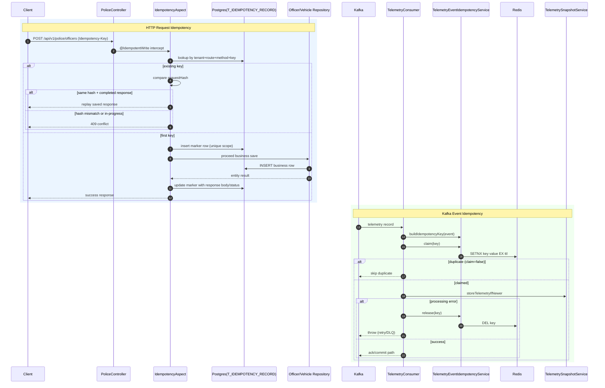

# Idempotency Deep-Dive (Request + Event)

## Why idempotency is needed in this project
This system has two duplicate-risk surfaces:
1. **HTTP write retries** (client/network retrying POST officer/vehicle).
2. **Kafka at-least-once delivery** (same telemetry event can be re-delivered).

Without idempotency:
- duplicate POSTs could create duplicate business records,
- duplicate Kafka events could repeatedly mutate Redis digital twin state.

So the repo implements **two different idempotency patterns**:
- request idempotency in `device-service` (DB-backed AOP),
- event idempotency in `event-service` (Redis marker claim with TTL).

---

## 1) Request idempotency vs event idempotency

| Dimension | Request idempotency (device-service) | Event idempotency (event-service) |
|---|---|---|
| Trigger | REST POST (`/api/v1/police/officers`, `/vehicles`) | Kafka consumer for telemetry |
| Key source | Client `Idempotency-Key` header + scope | Deterministic key from telemetry payload |
| Storage | PostgreSQL table `T_IDEMPOTENCY_RECORD` | Redis key marker |
| Atomic guard | Unique index + transaction + insert race handling | `SETNX` semantics via `setIfAbsent` |
| Replay behavior | Returns same prior response body/status | Skips duplicate event processing |
| Failure recovery | Transaction rollback (no committed record) | Explicit `release()` on processing failure |
| Retention | Persistent table (no TTL in current implementation) | TTL (`police.event.idempotency.ttl`, default 24h) |

---

## 2) Important classes and methods

### Request idempotency (POST APIs)
- Annotation: `device-service/.../IdempotentWrite.java`
- Aspect: `device-service/.../IdempotencyAspect.java`
  - `enforceIdempotency(...)`
  - `replayOrReject(...)`
  - `hashPayload(...)`
- Entity: `device-service/.../IdempotencyRecord.java`
- Repository: `device-service/.../IdempotencyRecordRepository.java`
- Exceptions/handler:
  - `MissingIdempotencyKeyException`
  - `IdempotencyConflictException`
  - `IdempotencyExceptionHandler`
- Schema: `device-service/.../V1.1.0__Add_Idempotency_Records.sql`

### Event idempotency (Kafka)
- Service: `event-service/.../TelemetryEventIdempotencyService.java`
  - `buildIdempotencyKey(...)`
  - `claim(...)`
  - `release(...)`
- Consumer integration: `event-service/.../TelemetryConsumer.java`
- Config: `event-service/src/main/resources/application.yaml`
  - `police.event.idempotency.ttl`

---

## 3) Code flow explanation

## A) Request idempotency flow (`@IdempotentWrite`)
1. A POST endpoint annotated with `@IdempotentWrite` is intercepted.
2. Aspect reads:
   - tenant (`TenantContext`),
   - `Idempotency-Key` header,
   - route + method,
   - request payload.
3. If key is missing/blank → throw `MissingIdempotencyKeyException` (`400`).
4. Aspect computes `requestHash` = SHA-256(JSON(payload)).
5. Lookup existing record by unique scope `(tenantId, route, method, idempotencyKey)`.
6. If existing record found:
   - same hash + completed response saved → replay stored response body/status,
   - different hash → conflict (`409`),
   - response not yet saved → in-progress conflict (`409`).
7. If no record exists, insert marker row first (`saveAndFlush`) then call business method.
8. After success, persist response status/body in marker row.

### Same key + same payload
- Returns previously stored response (no duplicate business row).

### Same key + different payload
- Rejected as `409` (`IdempotencyConflictException`).

### If processing fails
- Aspect method is transactional; failure throws and transaction rolls back.
- Marker/changes from that transaction are not committed, so retried call can proceed.

## B) Event idempotency flow (Kafka consumer)
1. `TelemetryConsumer` deserializes message.
2. Builds deterministic idempotency key:
   - preferred: `event:idempotency:{tenant}:{device}:event:{eventId}`
   - fallback: `...:ts:{timestamp}` when eventId missing.
3. Calls `claim(key)` which does Redis `setIfAbsent(key, "1", ttl)` (SETNX+TTL behavior).
4. If claim fails (`false`) → duplicate; skip processing.
5. If claim succeeds:
   - process telemetry write/update.
6. If processing throws after claim:
   - call `release(key)` (delete marker),
   - rethrow to allow retry/DLQ logic.
7. If processing succeeds:
   - marker is retained until TTL expiry.

### Redis SETNX + TTL usage
- `setIfAbsent` ensures atomic first-writer wins dedupe claim.
- TTL bounds memory and dedupe window.

---

## 4) Race condition handling

## Request side (PostgreSQL)
- Two concurrent requests with same scope may both see “not found” initially.
- Unique index (`UK_IDEMPOTENCY_SCOPE`) allows only one insert.
- Losing transaction gets `DataIntegrityViolationException`, then re-reads winning row and applies replay/conflict logic.

## Event side (Redis)
- `SETNX` is atomic; only one consumer can claim a given key during TTL window.
- Others read `false` and skip duplicate processing.

---

## 5) Failure scenarios and behaviors

1. **Missing `Idempotency-Key` (POST write)**
   - HTTP `400` from `IdempotencyExceptionHandler`.
2. **Same key, different payload**
   - HTTP `409` (conflict) to prevent semantic misuse.
3. **Same key replay while first request still in progress**
   - HTTP `409` (“already in progress”).
4. **Business failure after request marker insert**
   - Transaction rollback; no committed replay row.
5. **Redis unavailable during `claim`**
   - consumer throws; retry/DLQ path handles failures.
6. **Processing failure after successful event claim**
   - marker is released, then exception rethrown for retry.
7. **Duplicate Kafka event after successful processing**
   - claim fails; event skipped.
8. **Stale event with unique idempotency key**
   - idempotency claim can succeed, but stale ordering logic may skip write; marker remains (intended).

---

## 6) Mermaid sequence diagram

---

## 7) Edge cases and production improvements

1. **Payload hashing determinism**
   - Current hash depends on Jackson serialization of first method arg.
   - Improvement: canonical JSON (stable field ordering, normalization rules) to reduce accidental mismatches.
2. **Response replay schema drift**
   - Stored response JSON is deserialized to method return type.
   - Improvement: versioned response envelope in idempotency record.
3. **Unbounded request-idempotency table growth**
   - No retention policy currently.
   - Improvement: TTL-like cleanup job/partition pruning by `CREATED_AT`.
4. **Redis dedupe key collisions in fallback mode**
   - `tenant+device+timestamp` can collide for distinct events.
   - Improvement: require upstream `eventId` or include stronger uniqueness dimensions.
5. **At-least-once semantics remain**
   - Idempotency reduces duplicates; not full exactly-once across all side effects.
   - Improvement: transactional outbox or stronger end-to-end EOS patterns where needed.
6. **Multi-step side effects after claim**
   - If success occurs before crash but before commit/ack boundary, duplicates can still arise downstream.
   - Improvement: make downstream writes idempotent too (already partly done with stale-check logic).
7. **Race visibility / observability**
   - Improvement: add structured metrics for request replay/conflict/in-progress counts and latency impact.
8. **Tenant safety hardening**
   - Request scope already includes tenant; keep this invariant for all future idempotent APIs.

---

## 8) Interview explanation script (90 seconds)

"This repo uses two idempotency mechanisms because duplicates happen in both HTTP and Kafka flows. For REST POST writes in `device-service`, an AOP annotation `@IdempotentWrite` enforces idempotency with a PostgreSQL ledger table. The scope is tenant + route + method + key, and payload integrity is checked with SHA-256 hash of serialized request body. Same key/same payload replays the original response; same key/different payload returns 409.

For Kafka telemetry in `event-service`, idempotency is marker-based in Redis. The consumer builds a deterministic key, then claims it atomically with SETNX + TTL. If claim fails, it’s a duplicate and is skipped. If processing fails after claim, marker is deleted and exception is rethrown so retry/DLQ still works.

So request idempotency is replay-oriented and persisted in SQL, while event idempotency is dedupe-oriented and time-bounded in Redis." 

---

## 9) Deep interview Q&A with tradeoffs

### Q1) Why not use one idempotency mechanism for both HTTP and Kafka?
**Answer:** HTTP benefits from deterministic response replay; Kafka consumer mainly needs fast duplicate suppression.
**Tradeoff:** Two mechanisms increase conceptual complexity.

### Q2) Why include tenant in idempotency scope?
**Answer:** Prevents cross-tenant collisions for same client key.
**Tradeoff:** Key cardinality increases and requires tenant context integrity.

### Q3) Why hash payload instead of storing full request only?
**Answer:** Cheap equality check to detect misuse of same key with changed body.
**Tradeoff:** Serialization differences can cause false mismatches unless canonicalized.

### Q4) Why release Redis marker on failure?
**Answer:** Lets retry attempt process event again instead of being permanently blocked by claimed key.
**Tradeoff:** Brief race windows can still allow repeated attempts under instability.

### Q5) Why keep marker after stale skip?
**Answer:** Event was already observed and deemed non-updatable; reprocessing would be wasteful.
**Tradeoff:** Requires confidence in stale-detection correctness.

### Q6) Could request idempotency incorrectly replay if endpoint logic changes?
**Answer:** Yes, old saved response shape may diverge from new code expectations.
**Tradeoff:** Replay stability vs deploy evolution complexity.

### Q7) Does this guarantee exactly-once processing?
**Answer:** No. It guarantees practical dedupe at key boundaries.
**Tradeoff:** Simpler operations than true end-to-end exactly-once.

### Q8) What is biggest production risk today?
**Answer:** Operational cleanup/retention (SQL records, Redis TTL tuning) and fallback key collisions when eventId is absent.
**Tradeoff:** Simplicity now vs long-term scale robustness.

### Q9) How is race handled for concurrent same idempotency key HTTP calls?
**Answer:** DB unique index + exception catch-and-replay logic in aspect.
**Tradeoff:** one request may see conflict/in-progress instead of transparent replay in some timing windows.

### Q10) What quick wins would you prioritize?
**Answer:** canonical payload hashing, idempotency table cleanup job, mandatory eventId from producer contracts, and dedicated idempotency metrics dashboards.
