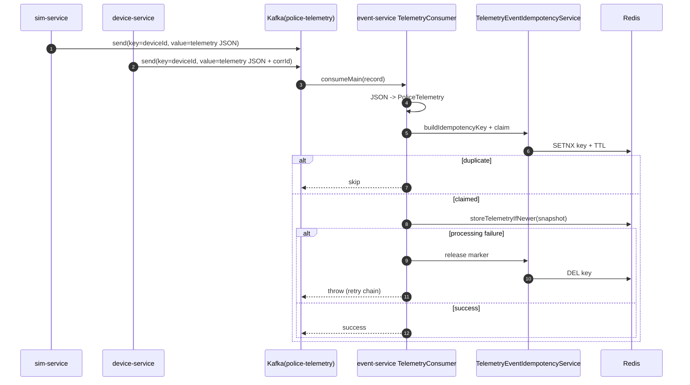
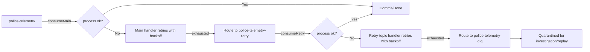

# Kafka Telemetry Flow Deep-Dive

## End-to-end telemetry flow (high level)
1. **Telemetry production** happens from:
   - `sim-service` scheduled simulator (`DeviceLoadSimulator`) and
   - `device-service` telemetry publish API (`TelemetryPublishService`).
2. Both producers publish JSON `PoliceTelemetry` payloads to **`police-telemetry`** using key = `deviceId`.
3. `event-service` consumes with `@KafkaListener` (`TelemetryConsumer.consumeMain`) in group `police-event-group`.
4. Consumer deserializes JSON with Jackson, performs idempotency claim and stale-order checks, then updates Redis snapshot.
5. If processing throws, Spring Kafka `DefaultErrorHandler` retries locally; after exhaustion routes:
   - main topic failure → `police-telemetry-retry`
   - retry topic failure → `police-telemetry-dlq`

---

## 1) How telemetry is published

### Producer paths
- **sim-service producer**
  - Class: `DeviceLoadSimulator`
  - Method: `publishTelemetry(String deviceId, String payload)`
  - Send call: `kafkaTemplate.send("police-telemetry", deviceId, payload)`

- **device-service producer**
  - Class: `TelemetryPublishService`
  - Method: `publish(PoliceTelemetry telemetry)`
  - Serializes `PoliceTelemetry` with `ObjectMapper`
  - Sends `Message<?>` with:
    - `KafkaHeaders.TOPIC = police-telemetry`
    - `KafkaHeaders.KEY = telemetry.deviceId`
    - optional `X-Correlation-ID` header from MDC

### KafkaTemplate usage
- `KafkaTemplate<String, String>` is used in both producer services.
- Payload format is plain JSON string (no schema registry in current setup).

---

## 2) Producer/consumer class mapping

| Concern | Service | Class | Method(s) | Notes |
|---|---|---|---|---|
| Telemetry producer (simulated load) | sim-service | `DeviceLoadSimulator` | `simulateTelemetry`, `publishTelemetry` | Scheduled burst producer, key = deviceId |
| Telemetry producer (API ingress) | device-service | `TelemetryPublishService` | `publish` | API-driven producer with correlation header propagation |
| Telemetry consumer (main topic) | event-service | `TelemetryConsumer` | `consumeMain` | `@KafkaListener` on `police-telemetry` |
| Telemetry consumer (retry topic) | event-service | `TelemetryConsumer` | `consumeRetry` | `@KafkaListener` on `police-telemetry-retry` |
| Main retry handler | event-service | `KafkaConsumerErrorHandlingConfig` | `mainTopicErrorHandler` | Routes to retry topic after attempts exhausted |
| Retry retry handler | event-service | `KafkaConsumerErrorHandlingConfig` | `retryTopicErrorHandler` | Routes to DLQ after attempts exhausted |

---

## 3) Topic table

| Topic | Purpose | Producer(s) | Consumer | Failure route |
|---|---|---|---|---|
| `police-telemetry` | Primary telemetry ingress | sim-service, device-service | `TelemetryConsumer.consumeMain` | On exhausted retries -> `police-telemetry-retry` |
| `police-telemetry-retry` | Secondary retry lane | `DeadLetterPublishingRecoverer` from main handler | `TelemetryConsumer.consumeRetry` | On exhausted retries -> `police-telemetry-dlq` |
| `police-telemetry-dlq` | Dead-letter quarantine | `DeadLetterPublishingRecoverer` from retry handler | (No built-in replay consumer here) | Terminal sink for poison/persistent failures |

### Provisioning
- Topics are created with 50 partitions (both via `KafkaConfig` beans and docker `kafka-init`).

---

## 4) Why `deviceId` is used as Kafka key

`deviceId` key choice gives **per-device partition affinity**:
- all records for same device hash to the same partition,
- Kafka preserves order within a partition,
- consumer can apply timestamp ordering/stale checks with coherent per-device stream.

This is why keying by `deviceId` is useful for telemetry timelines.

---

## 5) Ordering guarantees in current design

1. Kafka guarantees order only **within a partition**.
2. `deviceId` key keeps per-device records co-located in one partition.
3. `TelemetrySnapshotService.storeTelemetryIfNewer(...)` prevents older/equal timestamp event from overwriting a newer snapshot.

So ordering is maintained as:
- partition-order + key affinity + stale-update guard.

Not guaranteed:
- global cross-device ordering,
- perfect event-time ordering under producer clock skew.

---

## 6) Serialization/deserialization

### Producer side
- Both producers serialize `PoliceTelemetry` to JSON string using Jackson `ObjectMapper`.
- Kafka producer config uses `StringSerializer` for key/value.

### Consumer side
- Kafka consumer config uses `StringDeserializer` for key/value.
- `TelemetryConsumer` manually converts `record.value()` JSON string → `PoliceTelemetry` via `ObjectMapper.readValue(...)`.

### Poison-message implication
- Malformed JSON or incompatible payload throws during deserialization in `processRecord`, which is then retried and potentially DLQ-routed by error handlers.

---

## 7) Retry and DLQ behavior

### Main topic retry
- Listener container factory: `telemetryMainKafkaListenerContainerFactory`.
- Error handler: `mainTopicErrorHandler`.
- Backoff config (default):
  - attempts: `police.kafka.retry.main.attempts=2`
  - backoff: `police.kafka.retry.main.backoff-ms=1000`
- After retries exhausted: publish same record to `police-telemetry-retry` (same partition index).

### Retry topic retry
- Listener container factory: `telemetryRetryKafkaListenerContainerFactory`.
- Error handler: `retryTopicErrorHandler`.
- Backoff config (default):
  - attempts: `police.kafka.retry.retry-topic.attempts=2`
  - backoff: `police.kafka.retry.retry-topic.backoff-ms=2000`
- After retries exhausted: publish to `police-telemetry-dlq`.

### What goes to DLQ
- Records that keep failing even after retry topic attempts.
- Typical examples: poison payloads, persistent processing bugs, unrecoverable downstream errors.

---

## 8) Poison message handling

Poison message path:
1. `TelemetryConsumer.processRecord` throws (deserialization/processing error).
2. Main handler retries locally; still failing -> route to retry topic.
3. Retry listener retries locally; still failing -> route to DLQ.

This isolates bad records so they stop blocking normal telemetry flow.

---

## 9) What happens if consumer fails

If `TelemetryConsumer` throws exception:
- metric `event.kafka.consume.failures` increments,
- Spring Kafka `DefaultErrorHandler` applies retry/backoff,
- exhausted records are forwarded to next topic via `DeadLetterPublishingRecoverer`.

Additional nuance:
- idempotency marker is released on processing failure after claim (to allow retry to reprocess), then exception is rethrown.

---

## 10) Scaling with partitions and consumer groups

### Current setup
- 50 partitions for telemetry/retry/dlq topics.
- Consumer group: `police-event-group`.

### Scaling behavior
- Within one group, max parallelism is bounded by partition count.
- More `event-service` instances in same group -> partition rebalancing and horizontal throughput increase (up to 50 active consumers per topic at once).
- `deviceId` key distribution quality determines hot-partition risk.

### Tradeoffs
- More partitions improve parallelism but increase broker/consumer overhead.
- Skewed device traffic (hot keys) can limit effective scale.

---

## Mermaid sequence diagram (end-to-end)

---

## Mermaid retry/DLQ diagram

---

## Interview Q&A (pros/tradeoffs)

### Q1) Which services produce telemetry and why two producers?
**Answer:** `sim-service` produces load/synthetic data; `device-service` allows API-driven publish path.
**Tradeoff:** Flexibility for testing and runtime ingestion, but requires consistent payload contracts.

### Q2) Why use `deviceId` as partition key?
**Answer:** Keeps per-device ordering by pinning same device to one partition.
**Tradeoff:** Hot devices can create partition skew.

### Q3) Is ordering guaranteed end-to-end?
**Answer:** Ordered per partition/device, not globally. Stale-timestamp guard prevents old overwrites.
**Tradeoff:** Requires reliable producer timestamps.

### Q4) How do retries differ from DLQ?
**Answer:** Retry topic is another attempt lane; DLQ is terminal quarantine for persistent failures.
**Tradeoff:** Extra topics/operations overhead.

### Q5) What are poison messages here?
**Answer:** Records that always fail deserialization or business processing.
**Tradeoff:** Need external DLQ replay/remediation tooling (not built in by default).

### Q6) How does consumer failure propagate?
**Answer:** Listener throws; Spring Kafka error handlers apply retries and route onward.
**Tradeoff:** Exception propagation must not be swallowed in processing path.

### Q7) Why String serializer/deserializer instead of typed serde?
**Answer:** Simpler interop and visibility for JSON payloads.
**Tradeoff:** Runtime parsing errors move to consumer logic.

### Q8) How does this architecture scale?
**Answer:** Horizontally by increasing consumer instances in same group up to partition count.
**Tradeoff:** Partition count planning and key-distribution tuning are critical.

### Q9) What happens to duplicates?
**Answer:** Redis idempotency claim skips duplicates; metrics capture skipped duplicates.
**Tradeoff:** TTL/window tuning may allow very-late duplicates after expiry.

### Q10) What production improvements would you prioritize?
**Answer:** DLQ replay pipeline, schema governance (Avro/Protobuf + registry), hot-partition monitoring, and stricter classification of retryable vs non-retryable exceptions.
