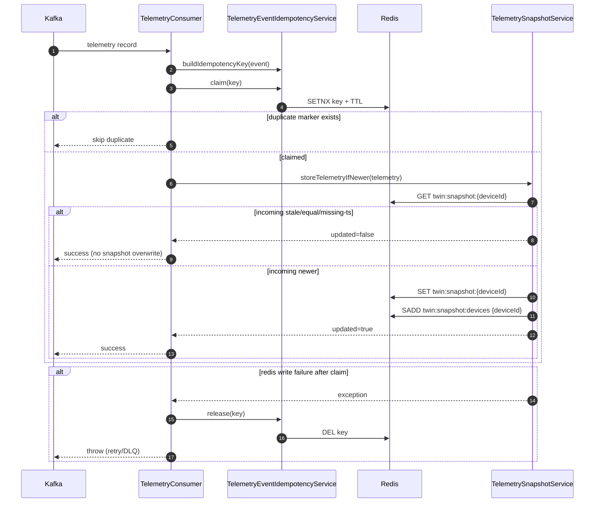

# Redis Digital Twin Snapshot Handling

## Scope
This document covers Redis usage in `event-service` for telemetry digital-twin snapshots and related idempotency markers.

---

## 1) Redis configuration and client usage

### Configuration
- `RedisConfig` defines a single `RedisTemplate<String, Object>` bean.
- Key serializer: `StringRedisSerializer`.
- Value serializer: `GenericJackson2JsonRedisSerializer` with Java time support (`JavaTimeModule`) and ISO date serialization.
- Redis connection properties are profile-based in `application-dev.yaml` and `application-prod.yaml`.

### Client usage
- `RedisTemplate<String, Object>` is used in:
  - `TelemetrySnapshotService` (digital twin read/write/index)
  - `TelemetryEventIdempotencyService` (event marker claim/release)
- `StringRedisTemplate` is **not** used in current codebase.

---

## 2) What data is stored in Redis

Two categories are stored:

1. **Latest telemetry snapshots (digital twin)**
   - Value objects of `PoliceTelemetry` per device.
   - One logical latest state per device.

2. **Event idempotency markers**
   - Short marker value (`"1"`) keyed by deterministic idempotency key.
   - Used to skip duplicate Kafka deliveries in TTL window.

---

## 3) Redis key table

| Key pattern | Type | Value | Written by | TTL |
|---|---|---|---|---|
| `twin:snapshot:{deviceId}` | String/value | Latest `PoliceTelemetry` JSON | `TelemetrySnapshotService.storeTelemetry*` | No TTL configured |
| `twin:snapshot:devices` | Set | Set of known `deviceId` values | `TelemetrySnapshotService.storeTelemetry*` | No TTL configured |
| `event:idempotency:{tenant}:{device}:event:{eventId}` | String/value | Marker `"1"` | `TelemetryEventIdempotencyService.claim` | Yes (`police.event.idempotency.ttl`, default 24h) |
| `event:idempotency:{tenant}:{device}:ts:{timestamp}` | String/value | Marker `"1"` (fallback key format) | `TelemetryEventIdempotencyService.claim` | Yes (same TTL) |

---

## 4) Why Redis is used instead of PostgreSQL for latest telemetry

Redis is used as a **real-time latest-state store** because this flow is read-heavy and low-latency:
- fast point reads by device key,
- quick aggregation of active devices via index set,
- efficient overwrite model for “current state” (not append history).

PostgreSQL is better suited for durable relational domain data (officers, vehicles, commands), while Redis better matches hot digital-twin lookup patterns.

---

## 5) Snapshot update flow (latest-state logic)

`TelemetryConsumer` calls `TelemetrySnapshotService.storeTelemetryIfNewer(telemetry)` after idempotency claim.

Update algorithm:
1. Build snapshot key: `twin:snapshot:{deviceId}`.
2. Read current snapshot from Redis.
3. Compare `incoming.timestamp` vs `current.timestamp`.
4. If incoming is stale/equal/missing timestamp when current exists -> skip update.
5. Else write incoming snapshot to `twin:snapshot:{deviceId}`.
6. Add `deviceId` to set `twin:snapshot:devices`.

Result object `SnapshotStoreResult(updated, existingTimestamp)` is returned to caller.

---

## 6) How stale events are detected

Stale detection in `TelemetrySnapshotService`:
- `OLDER`: incoming timestamp is before current timestamp.
- `EQUAL`: incoming timestamp equals current timestamp.
- `MISSING_INCOMING_TIMESTAMP`: incoming timestamp null while current exists.

If stale reason exists:
- snapshot write is skipped,
- metric `event.snapshot.stale.skipped` increments with reason tag.

---

## 7) What happens for duplicate events

Duplicate detection is done **before snapshot write** via Redis idempotency marker claim:
1. Build idempotency key (`eventId` preferred, timestamp fallback).
2. `setIfAbsent(key, "1", ttl)`:
   - `true` => first-seen event, continue processing
   - `false` => duplicate, skip processing

If processing fails after successful claim:
- marker is deleted (`release`) so retry can process again.

---

## 8) What happens if Redis is down

Redis failures are handled by resilience annotations + fallbacks:

### Read APIs (`getDeviceTelemetry`, `getAllTelemetry`)
- Fallback returns `null` (single device) or empty list (all devices).
- Failure metric `event.redis.operation.failures` increments.
- API may appear degraded but stays responsive.

### Write path (`storeTelemetryIfNewer`)
- Fallback throws runtime exception (`Ordered telemetry snapshot write failed`).
- Consumer catches and rethrows after releasing idempotency marker.
- Kafka retry/DLQ chain is triggered by propagated exception.

This means read failures degrade gracefully; write failures are surfaced for retry and eventual DLQ routing.

---

## 9) Cache consistency concerns

1. **Two-key update non-atomicity**
   - Snapshot key and device index set are written separately.
   - Partial success can temporarily desync index and payload key.
2. **No snapshot TTL**
   - Stale inactive devices can remain forever unless explicitly cleaned.
3. **Fallback key collisions in idempotency**
   - `tenant+device+timestamp` may collide for distinct events.
4. **Event-time correctness dependency**
   - Stale-check logic depends on producer timestamp quality.
5. **Eventually consistent reads**
   - During retries/failures, latest snapshot may lag real-world state.

---

## 10) TTL / eviction strategy today

### Current behavior
- **Snapshot keys** (`twin:snapshot:*`) and index set have **no TTL** in code.
- **Idempotency markers** use TTL (`police.event.idempotency.ttl`, default `PT24H`).

### Implication
- Snapshot cache can grow and retain inactive devices.
- Idempotency memory footprint is bounded by TTL window.

---

## Mermaid sequence diagram (snapshot + stale + duplicate)

---

## Cache failure scenarios

1. **Redis read timeout on `GET /api/v1/telemetry/device/{id}`**
   - Fallback returns `null`; consumer unaffected.
2. **Redis read timeout on `GET /api/v1/telemetry/all`**
   - Fallback returns empty list.
3. **Redis write failure during snapshot update**
   - Exception propagates; Kafka retry path handles.
4. **Idempotency claim failure (Redis unavailable)**
   - Consumer processing fails; message enters retry/DLQ flow.
5. **Crash between snapshot SET and index SADD**
   - Snapshot exists but missing from index set; `getAllTelemetry` may undercount.
6. **Crash after claim, before write complete**
   - Marker release on caught failure enables retry.

---

## Interview explanation script (90 seconds)

"In this repo, Redis is the digital-twin store for latest telemetry in `event-service`. Each device’s latest state is stored at `twin:snapshot:{deviceId}`, and `twin:snapshot:devices` is a set index for list/count APIs. Kafka consumer processing first does idempotency claim in Redis using `SETNX + TTL` so duplicate events are skipped. Then it calls `storeTelemetryIfNewer`, which reads current snapshot and only overwrites if the incoming timestamp is strictly newer.

If Redis read APIs fail, service falls back to null/empty responses and records failure metrics. If Redis write fails during consumer processing, exception is rethrown so Kafka retry/DLQ can handle it; idempotency marker is released to allow reprocessing. Current design is low-latency and practical, but it has consistency tradeoffs like non-atomic two-key updates and no TTL on snapshot keys." 

---

## Deep Q&A with tradeoffs

### Q1) Why use Redis for latest state instead of PostgreSQL?
**Answer:** Constant overwrites + fast key lookups are a natural fit for Redis.
**Tradeoff:** We sacrifice relational guarantees and need explicit consistency handling.

### Q2) Why maintain `twin:snapshot:devices` set?
**Answer:** Enables `getAll`/`count` without key scans.
**Tradeoff:** Additional write path and potential index drift if partial failures happen.

### Q3) Why no TTL on snapshots?
**Answer:** Keeps long-lived device state available.
**Tradeoff:** Stale/inactive devices remain unless separate cleanup is added.

### Q4) How is stale telemetry blocked?
**Answer:** Incoming timestamp is compared with stored timestamp; older/equal events are skipped.
**Tradeoff:** Depends on clock quality and timestamp correctness.

### Q5) How are duplicates handled?
**Answer:** Redis idempotency marker claim (`SETNX`) before snapshot write.
**Tradeoff:** Fallback key mode (`timestamp`) can collide for distinct events.

### Q6) What if Redis is down during read APIs?
**Answer:** Fallback returns null/empty and records failure metrics.
**Tradeoff:** Availability preserved, but data freshness/visibility degrades.

### Q7) What if Redis is down during consumer writes?
**Answer:** Exception propagates -> Kafka retry and DLQ handling.
**Tradeoff:** Higher end-to-end latency and possible backlog growth.

### Q8) Is snapshot write + index update atomic?
**Answer:** No, they are separate Redis operations.
**Tradeoff:** Small inconsistency windows; Lua/script transaction could improve this.

### Q9) What production improvements matter most?
**Answer:** Snapshot TTL/cleanup policy, atomic multi-key write (Lua), stricter eventId requirements, and stronger observability/alerts on fallback metrics.
**Tradeoff:** More complexity and operational tuning overhead.

### Q10) How would you improve consistency guarantees?
**Answer:** Add atomic script for SET+SADD, periodic index repair job, and optional durable changelog/outbox for replayability.
**Tradeoff:** Higher implementation complexity but better correctness under failures.
