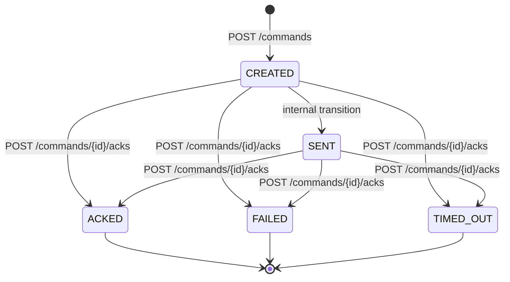
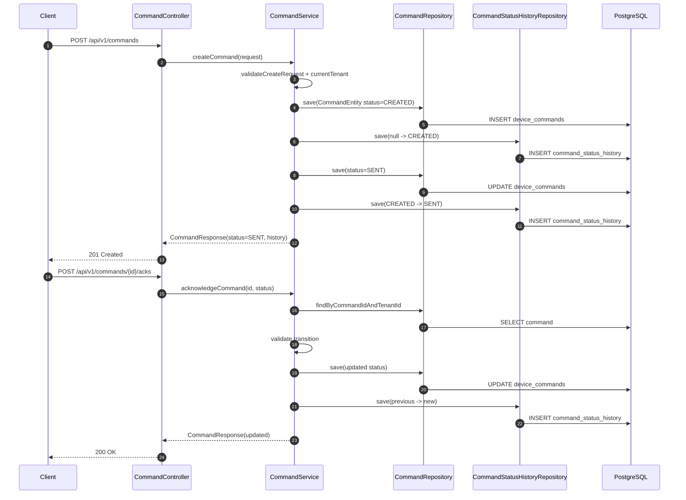

# Command Service Flow Deep-Dive

## Scope
This document explains how `command-service` handles command creation, status transitions, history/audit, tenant isolation, and what is (and is not) asynchronous in the current implementation.

---

## 1) Command lifecycle overview

Current lifecycle implemented in code:

1. API receives `POST /api/v1/commands`.
2. Service validates payload and stores command with status `CREATED`.
3. Service immediately transitions same command to `SENT` (currently internal placeholder step, not external dispatch).
4. Client/device(or another upstream) calls `POST /api/v1/commands/{id}/acks` with status:
   - `ACKED` (success),
   - `FAILED` (NACK-like failure), or
   - `TIMED_OUT`.
5. Each transition appends immutable history row in `command_status_history`.

---

## 2) How a command is created (step-by-step)

1. `CommandController#create(CreateCommandRequest)` receives request.
2. `CommandService#createCommand()` (`@Transactional`) runs:
   - resolves tenant from `TenantContext`,
   - validates required fields (`targetDeviceId`, `commandType`, `payload`),
   - constructs `CommandEntity` with `CREATED` status,
   - saves to `device_commands`,
   - appends history row (`null -> CREATED`),
   - transitions to `SENT` and appends second history row.
3. Returns `CommandResponse` containing command + ordered history list.

So command creation is currently a synchronous DB workflow.

---

## 3) Where command state is stored

### Primary state table
- `device_commands`
  - `command_id` (PK)
  - `tenant_id`
  - `target_device_id`
  - `command_type`
  - `payload`
  - `status`
  - audit timestamps (`created_at`, `updated_at`) and auditing users

### Transition history table
- `command_status_history`
  - `history_id` (PK)
  - `command_id` (FK to `device_commands`)
  - `tenant_id`
  - `from_status`
  - `to_status`
  - `reason`
  - `changed_at`

---

## 4) What statuses exist

From `CommandStatus` enum:
- `CREATED`
- `SENT`
- `ACKED`
- `FAILED`
- `TIMED_OUT`

`FAILED` and `TIMED_OUT` together represent negative outcomes (NACK/failure-like outcomes).

---

## 5) How command status changes

Transition logic is centralized in `CommandService.transition(...)`:
- updates `CommandEntity.status`,
- persists updated command row,
- appends history row via `appendHistory(...)`.

Validation rules in `acknowledgeCommand(...)`:
- Only requested statuses `ACKED | FAILED | TIMED_OUT` are accepted for ACK endpoint.
- ACK endpoint allowed only when current status is `CREATED` or `SENT`.
- Invalid transitions raise `InvalidCommandStatusTransitionException` -> HTTP `400`.

---

## 6) State transition table

| From | To | Allowed? | Trigger path | Notes |
|---|---|---|---|---|
| `null` | `CREATED` | Yes | create flow | first persisted state |
| `CREATED` | `SENT` | Yes | create flow | internal placeholder dispatch step |
| `CREATED` | `ACKED` | Yes | ack endpoint | allowed by service rule |
| `CREATED` | `FAILED` | Yes | ack endpoint | failure/NACK path |
| `CREATED` | `TIMED_OUT` | Yes | ack endpoint | timeout path |
| `SENT` | `ACKED` | Yes | ack endpoint | success ack |
| `SENT` | `FAILED` | Yes | ack endpoint | delivery/exec failed |
| `SENT` | `TIMED_OUT` | Yes | ack endpoint | no ack in SLA window |
| `ACKED/FAILED/TIMED_OUT` | any via ack endpoint | No | ack endpoint | rejected as invalid transition |
| any | `SENT` via ack endpoint | No | ack endpoint | requested status not allowed |

---

## 7) Sync vs async command flow

### Current implementation
- **Synchronous command service flow** for state persistence and transitions.
- No producer/consumer path for command dispatch in `command-service` runtime code.
- Kafka dependencies/config are present, but command creation does not publish command events/messages yet.

### Practical implication
- `SENT` currently means “dispatch placeholder completed,” not verified external delivery.

---

## 8) ACK/NACK handling and delivery-failure handling

### ACK handling
- `POST /api/v1/commands/{id}/acks` accepts `ACKED` status and reason.

### NACK/failure handling
- Same endpoint accepts `FAILED` or `TIMED_OUT`.
- These are treated as terminal command outcomes in current flow.

### Delivery failure + retries
- There is no explicit async delivery engine in this service yet, so:
  - no transport-level retry state machine for command dispatch,
  - no built-in exponential backoff for command delivery attempts,
  - retries would have to be modeled by calling APIs again or future async implementation.

---

## 9) How command history/audit is maintained

1. Every state change writes one row in `command_status_history`.
2. API response reconstructs timeline via:
   - `findByCommandIdAndTenantIdOrderByChangedAtAsc(...)`.
3. Command entity extends `BaseEntity`, so `createdAt/updatedAt` and auditor fields are maintained via JPA auditing.
4. History includes optional textual `reason` to preserve transition rationale.

---

## 10) Tenant isolation for commands

Tenant safety layers:
1. `CommandTenantFilter` resolves authenticated tenant claim and sets `TenantContext`.
2. Optional `X-Tenant-Id` must match authenticated tenant claim when provided.
3. Service always queries by `(commandId, tenantId)`.
4. History query also constrained by tenant.
5. Cross-tenant fetch returns not found (`404`) rather than exposing data.

---

## 11) Important classes and methods

| Area | Class | Method(s) |
|---|---|---|
| REST API | `CommandController` | `create`, `getById`, `acknowledge` |
| Business flow | `CommandService` | `createCommand`, `getCommand`, `acknowledgeCommand`, `transition`, `appendHistory` |
| Validation/errors | `CommandService`, `CommandExceptionHandler` | `validateCreateRequest`, invalid transition handling, not found handling |
| State model | `CommandEntity`, `CommandStatus` | status persistence + enum |
| Audit trail | `CommandStatusHistoryEntity` | transition history rows |
| Persistence | `CommandRepository`, `CommandStatusHistoryRepository` | tenant-scoped lookups |
| Tenant isolation | `CommandTenantFilter` | claim/header check, set/clear `TenantContext` |

---

## Command lifecycle diagram

---

## Mermaid sequence diagram

---

## Interview Q&A with tradeoffs

### Q1) Is command dispatch asynchronous today?
**Answer:** Not yet. Flow is synchronous DB state transitions; `SENT` is currently a placeholder state.
**Tradeoff:** Simpler implementation, but does not represent real delivery guarantees.

### Q2) Why keep both current status and history table?
**Answer:** Current table is fast for latest state; history table gives full audit trail.
**Tradeoff:** Dual writes per transition increase write amplification.

### Q3) How is command failure represented?
**Answer:** ACK endpoint can set `FAILED` or `TIMED_OUT`.
**Tradeoff:** Failure semantics rely on caller discipline; no built-in dispatch engine today.

### Q4) How are retries handled currently?
**Answer:** No internal delivery retry state machine exists in command-service.
**Tradeoff:** Easy now, but operational retries need external orchestration.

### Q5) How is tenant isolation enforced?
**Answer:** Tenant filter + tenant-scoped repository methods + tenant-bound history queries.
**Tradeoff:** Strong app-layer isolation, but DB-level RLS could further harden.

### Q6) Why validate transitions in service layer?
**Answer:** Centralized domain rule enforcement close to state changes.
**Tradeoff:** DB does not enforce transition graph, so rule drift is possible without tests.

### Q7) Does this support command deduplication?
**Answer:** Not explicitly in command-service create API.
**Tradeoff:** Potential duplicate command creation unless caller-side idempotency is added.

### Q8) What production improvements are most valuable?
**Answer:** Add async dispatch/outbox, delivery retries with backoff, terminal-state guards, command idempotency key, and richer status model (QUEUED, DISPATCHING, RETRYING).
**Tradeoff:** More complexity for stronger reliability/observability.

### Q9) How would you add Kafka-based async command delivery?
**Answer:** Persist command + outbox in one transaction, publish via outbox worker, consume ACK/NACK events to transition states.
**Tradeoff:** Eventual consistency and operational complexity, but scalable and resilient.

### Q10) What interview-ready takeaway summarizes this service?
**Answer:** It is a tenant-safe command state machine with durable audit history, currently synchronous and primed for future async orchestration.
