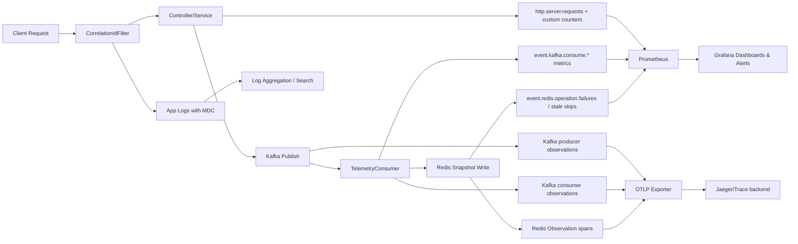

# Observability Deep-Dive

## Observability architecture

This repository uses a **logs + metrics + traces** stack across services:

1. **Logging**
   - Shared logback config (`common/logback-spring.xml`) with MDC fields:
     - `traceId`, `spanId`, `correlationId`, `tenantId`.
   - `CorrelationIdFilter` creates/propagates `X-Correlation-ID` and stores it in MDC.
   - `RequestLoggingFilter` logs request completion with status + duration.

2. **Metrics (Micrometer + Actuator + Prometheus)**
   - Actuator endpoints expose `health`, `info`, `metrics`, `prometheus`.
   - Custom counters exist for command lifecycle, Kafka consumption/retry routing, idempotency, Redis fallbacks, stale telemetry skips, simulator failures.

3. **Distributed tracing (Micrometer Tracing + OpenTelemetry OTLP)**
   - Tracing configured with W3C propagation and OTLP exporter endpoint.
   - Kafka observation enabled in producer/consumer paths.
   - Redis write operations in `TelemetrySnapshotService` wrapped with Micrometer `Observation` spans.

---

## 1) Correlation ID flow through requests

1. Client sends optional `X-Correlation-ID` header.
2. `CorrelationIdFilter`:
   - reads header or generates UUID,
   - places it into MDC (`correlationId`),
   - echoes it in response header.
3. Downstream logs automatically include it (logback pattern).
4. For telemetry publish path, `TelemetryPublishService` reads MDC and writes correlation header into Kafka message headers.
5. `TelemetryConsumer` extracts correlation header from Kafka record and includes it in logs.

This gives request->Kafka->consumer log continuity even across service boundaries.

---

## 2) How logs are connected across services

Correlation is done with layered identifiers:
- `correlationId` for application-level request linkage.
- `traceId`/`spanId` for distributed tracing linkage.
- `tenantId` for multi-tenant filtering in logs.

Because logback includes all four MDC fields, you can pivot by:
- trace (`traceId`) for distributed timeline,
- correlation (`correlationId`) for app request chain,
- tenant (`tenantId`) for scoped investigations.

---

## 3) Metrics exposed (what exists now)

### Core custom metrics table

| Metric | Type | Where emitted | Purpose |
|---|---|---|---|
| `commands.created` | Counter | `CommandService.createCommand` | command creation volume |
| `commands.acked` | Counter | `CommandService.acknowledgeCommand` | successful command acks |
| `commands.failed` | Counter | `CommandService.acknowledgeCommand` | failed command outcomes |
| `commands.timed_out` | Counter | `CommandService.acknowledgeCommand` | timed-out command outcomes |
| `event.kafka.consume.success` | Counter (tag `topic`) | `TelemetryConsumer` | successful telemetry processing |
| `event.kafka.consume.failures` | Counter (tag `topic`) | `TelemetryConsumer` | telemetry processing failures |
| `event.kafka.consume.duplicates.skipped` | Counter (tag `topic`) | `TelemetryConsumer` | duplicate events skipped |
| `event.kafka.consume.retry.attempts` | Counter (tags `topic`,`attempt`) | `KafkaConsumerErrorHandlingConfig` | retry attempt tracking |
| `event.kafka.consume.failures.routed` | Counter (tags `path`,`destination`) | `KafkaConsumerErrorHandlingConfig` | failures routed to retry/DLQ |
| `event.snapshot.stale.skipped` | Counter (tag `reason`) | `TelemetrySnapshotService` | stale/equal/missing-ts skips |
| `event.redis.operation.failures` | Counter (tags `operation`,`exception`) | `TelemetrySnapshotService` fallbacks | Redis read/write fallback frequency |
| `event.idempotency.claim` | Counter (tag `result`) | `TelemetryEventIdempotencyService` | claimed vs duplicate marker rate |
| `event.idempotency.release` | Counter (tag `result`) | `TelemetryEventIdempotencyService` | marker release health |
| `simulator.tasks.rejected` | Counter | `DeviceLoadSimulator` | executor saturation signal |
| `simulator.publish.failures` | Counter (tag `exception`) | `DeviceLoadSimulator` fallback | publish reliability issues |

### Plus default framework metrics
- `http.server.requests` (latency/status/endpoints)
- JVM/memory/thread metrics
- Tomcat metrics
- Kafka client/listener observations (when observation enabled)

---

## 4) Actuator configuration summary

Services expose actuator web endpoints with at least:
- `health`
- `info`
- `metrics`
- `prometheus`

Health groups include probes:
- liveness/readiness/startup per service.
- readiness includes `db` for device/command and `redis` for event-service.

Security config allows `/actuator/**` in all services, making metrics scrape-friendly.

---

## 5) Prometheus/Grafana usage

Recommended pipeline:
1. Prometheus scrapes `/actuator/prometheus` from all services.
2. Grafana dashboards consume Prometheus data.
3. Build service and domain dashboards:
   - HTTP rate/error/latency by endpoint
   - command outcomes (`commands.*`)
   - Kafka process health (`event.kafka.consume.*`)
   - Redis degradation (`event.redis.operation.failures`)
   - simulator pressure (`simulator.tasks.rejected`, `simulator.publish.failures`)

---

## 6) Kafka consumer lag monitoring

Current code emits processing/retry/failure counters, but **not direct consumer lag gauge**.

Production-style lag monitoring options:
1. Kafka exporter (e.g., `kafka_exporter`) + Prometheus:
   - monitor `consumer_group_lag` for `police-event-group`.
2. Broker JMX metrics via JMX exporter.
3. Alert when lag growth rate stays positive while consume success is low.

Useful composite view:
- lag by topic/partition + `event.kafka.consume.success/failures` + retry routed counts.

---

## 7) Redis/cache issue monitoring

Use these signals together:
1. `event.redis.operation.failures` by operation/exception.
2. `readiness` health for redis in event-service.
3. `event.snapshot.stale.skipped` distribution (unexpected spikes may indicate producer clock/order issues).
4. `event.idempotency.claim` ratio (high duplicate ratio can indicate replay/retry storms).

Add infra-level Redis metrics (INFO exporter) for:
- memory fragmentation,
- key count growth,
- evictions,
- latency/slowlog.

---

## 8) p95/p99 latency calculation

You can compute p95/p99 from `http.server.requests` in Prometheus using histogram buckets.

Example queries (service-level):

```promql
histogram_quantile(0.95, sum(rate(http_server_requests_seconds_bucket{job="event-service"}[5m])) by (le))
histogram_quantile(0.99, sum(rate(http_server_requests_seconds_bucket{job="event-service"}[5m])) by (le))
```

Endpoint-level:

```promql
histogram_quantile(0.95, sum(rate(http_server_requests_seconds_bucket{job="event-service",uri="/api/v1/telemetry/all"}[5m])) by (le))
```

Production note:
- Ensure histogram buckets/SLO boundaries are configured (`management.metrics.distribution.*`) so quantiles are stable and meaningful.

---

## 9) Log examples (what to expect)

### Request completion log
- `Finished request: method=GET, uri=/api/v1/telemetry/all, status=200, duration=15ms`

### Telemetry consumer success/failure logs
- `Received telemetry for device=... topic=... partition=... offset=... correlationId=...`
- `Skipping duplicate telemetry event. ... idempotencyKey=... correlationId=...`
- `Failed to process telemetry message. topic=... partition=... offset=... correlationId=...`

### Routing to retry/DLQ
- `Routing telemetry message after retries exhausted: sourceTopic=..., destinationTopic=..., partition=..., offset=...`

Because log pattern embeds MDC fields, each of these also carries trace/correlation/tenant context.

---

## Mermaid flow diagram (observability signals)



---

## 10) Alerts to configure (production baseline)

### API health / latency
1. High 5xx rate per service (e.g., >2% for 5m).
2. p95/p99 latency breach per critical endpoint.
3. Readiness probe failures (db/redis) sustained.

### Kafka pipeline
4. Consumer lag for `police-event-group` above threshold for N minutes.
5. `event.kafka.consume.failures` spike.
6. `event.kafka.consume.failures.routed{destination="police-telemetry-dlq"}` > 0 sustained.

### Redis/digital twin
7. `event.redis.operation.failures` spike by operation.
8. `event.snapshot.stale.skipped` sudden anomaly (older/equal/missing ts patterns).
9. `event.idempotency.claim{result="duplicate"}` ratio anomaly (possible replay storm).

### Command service
10. `commands.failed` / `commands.timed_out` rate increase over baseline.

---

## 11) Production improvements

1. Add centralized log pipeline (Loki/ELK/OpenSearch) with saved queries on `traceId/correlationId/tenantId`.
2. Expose and alert on Kafka lag via exporter/JMX metrics.
3. Define SLOs and explicit histogram buckets for critical endpoints and Kafka listeners.
4. Add `@Observed`/`@Timed` to critical business methods (e.g., command transitions, snapshot store path).
5. Add DLQ age/backlog dashboards + replay tooling observability.
6. Add Redis infra metrics dashboards (latency, memory, evictions, connections).
7. Move from dev sampling (1.0) to adaptive sampling in production.
8. Standardize structured JSON logging across all environments (not only prod profile).
9. Add multi-window/multi-burn-rate alerts tied to latency and error budget.
10. Add runbooks linked from alerts (what to check, likely causes, rollback/remediation steps).

---

## Interview Q&A (production-style answers)

### Q1) How does correlation flow end-to-end?
**Answer:** `CorrelationIdFilter` injects `X-Correlation-ID` into MDC and response. `TelemetryPublishService` forwards it to Kafka headers; `TelemetryConsumer` reads and logs it. In parallel, tracing uses `traceId/spanId` for distributed context.

### Q2) How do you debug a failed telemetry event quickly?
**Answer:** Start with DLQ route metrics and failure logs by correlationId/traceId; then inspect retry counters, idempotency metrics, and Redis fallback counters to pinpoint parse, duplicate, stale, or Redis-path failure.

### Q3) What is missing today for Kafka observability?
**Answer:** Native consumer lag visibility. Add Kafka exporter/JMX lag metrics and alert on sustained lag growth correlated with lower consume success.

### Q4) How would you set p95/p99 SLOs here?
**Answer:** Define endpoint SLOs on `http.server.requests` histograms (e.g., p95 < 200ms for telemetry reads), configure bucket boundaries, and use burn-rate alerts for error/latency budget breaches.

### Q5) How do you separate transient Redis blips from real incidents?
**Answer:** Combine readiness flaps, Redis fallback counters, and retry/DLQ movement. Single spikes may be transient; sustained fallbacks plus lag/DLQ growth indicates incident-level degradation.

### Q6) What logs are essential for on-call triage?
**Answer:** Request completion logs, telemetry consumer failure/routing logs (topic/partition/offset/idempotencyKey/correlationId), and command transition logs with tenant + reason.

### Q7) What’s your first dashboard for this system?
**Answer:** “Telemetry pipeline health” panel set: ingress rate, consumer success/fail, retry attempts, routed-to-DLQ, Redis failures, and lag in one timeline.

### Q8) Biggest production hardening step?
**Answer:** Close the monitoring loop with lag metrics + actionable alerting + runbooks; without that, strong instrumentation exists but incident response remains reactive.
