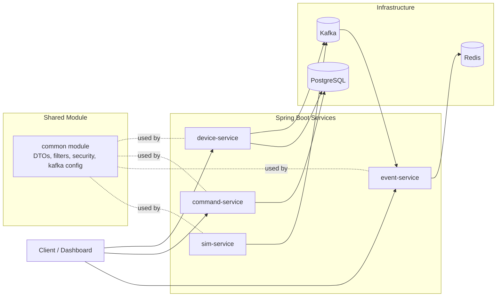
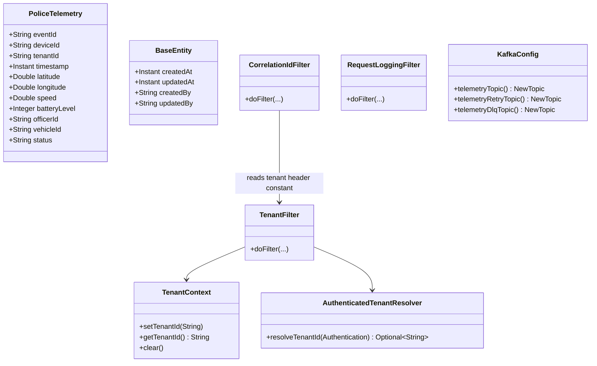
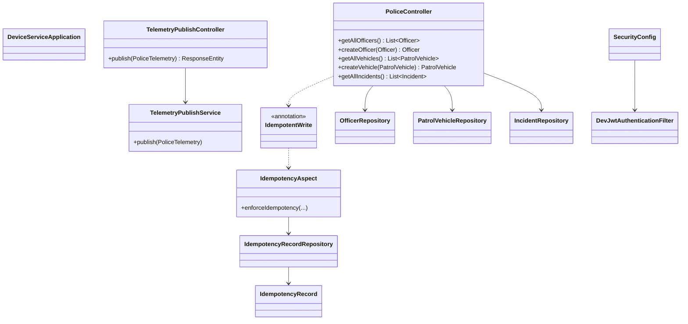
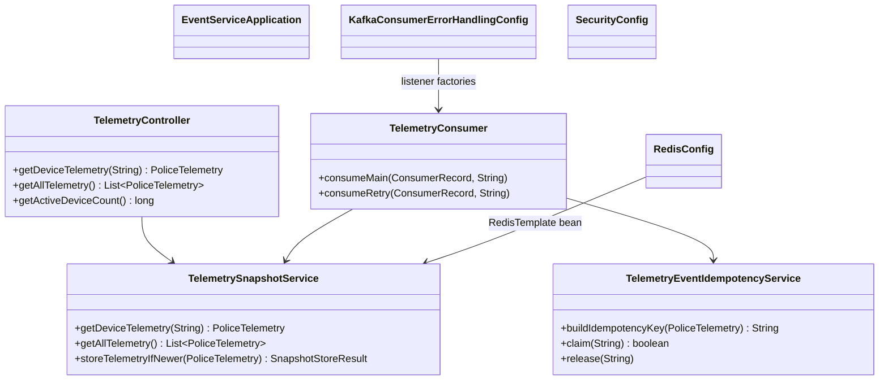
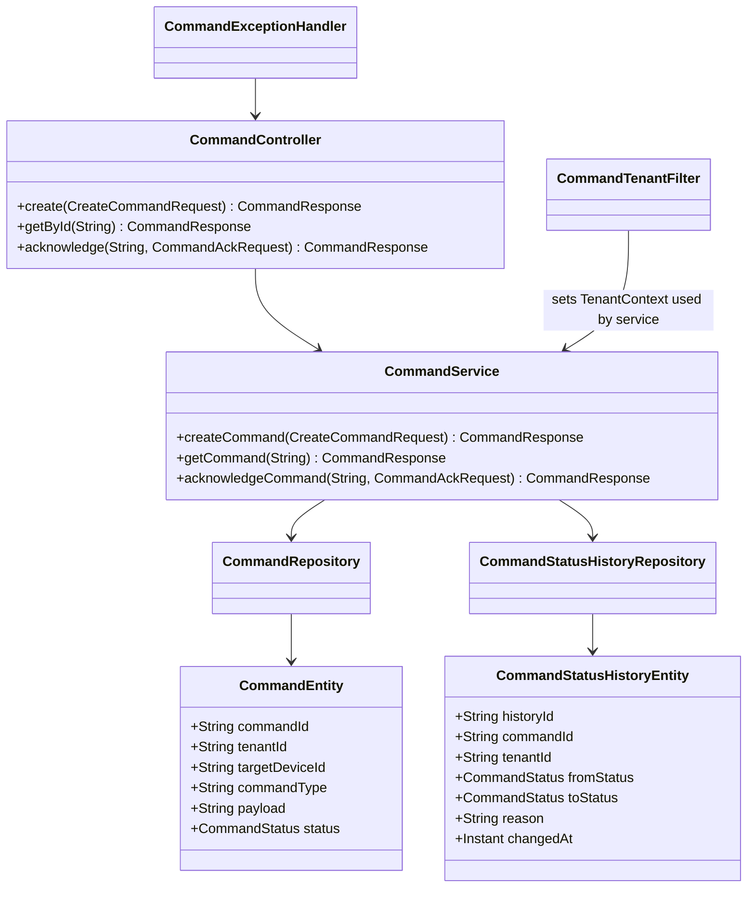
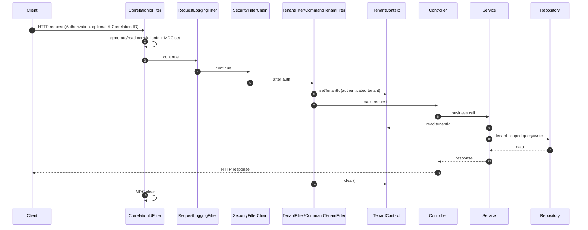
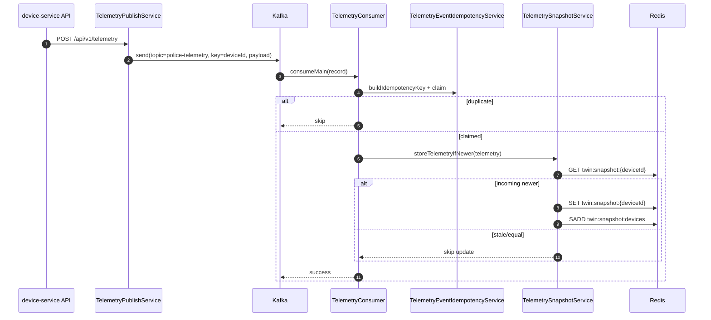
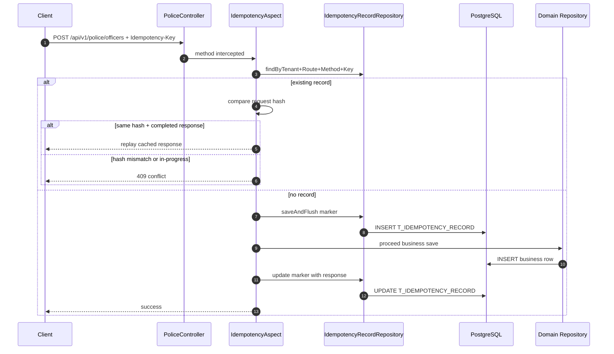
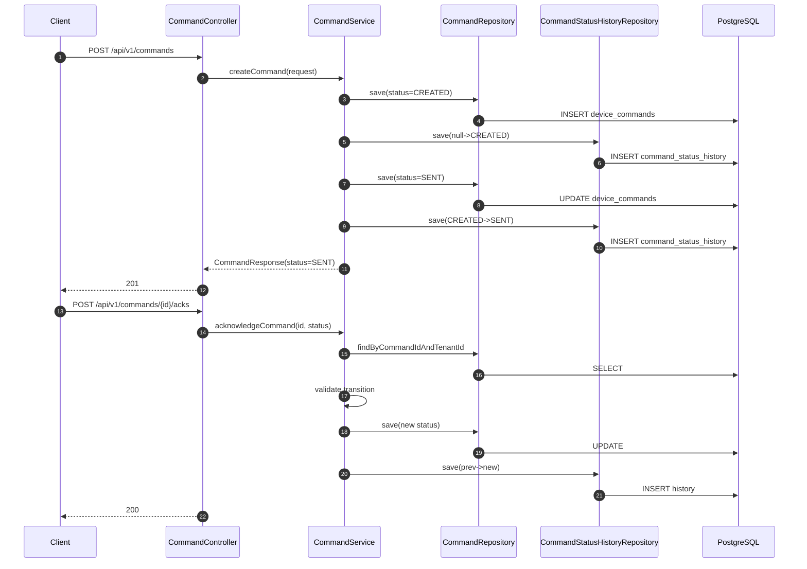
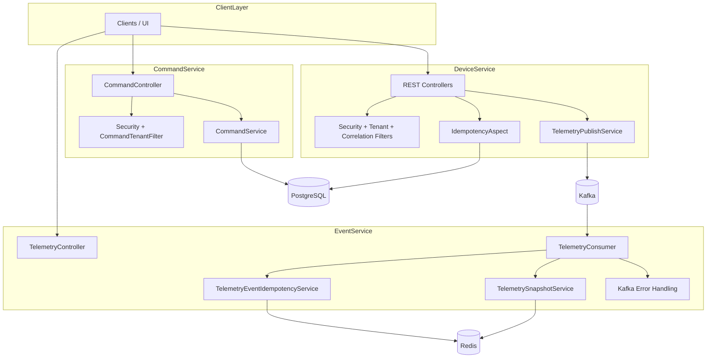

# UML Diagrams for Interview Presentation

This file contains interview-friendly Mermaid UML/architecture diagrams for the repository.

---

## 1) High-level architecture diagram

**Explanation:** Shows service boundaries, shared `common` module usage, and core runtime integrations with Kafka, Redis, and PostgreSQL.

---

## 2) Class diagram for `common` module

**Explanation:** Highlights shared DTOs, security/filter primitives, and topic declaration config reused by multiple services.

---

## 3) Class diagram for `device-service`

**Explanation:** Emphasizes CRUD-style police APIs, telemetry producer path, and AOP-based request idempotency.

---

## 4) Class diagram for `event-service`

**Explanation:** Shows event-service as Kafka consumer + Redis projection service + telemetry read API.

---

## 5) Class diagram for `command-service`

**Explanation:** Captures command state machine persistence model (current state + transition history) and tenant-filtered API path.

---

## 6) Sequence diagram: request flow with filters and tenant context

**Explanation:** Demonstrates filter ordering and how tenant/correlation context flows into business logic and is cleaned up safely.

---

## 7) Sequence diagram: telemetry publish-consume-cache flow

**Explanation:** Presents the main telemetry pipeline from API producer to Kafka consumer to Redis digital twin update.

---

## 8) Sequence diagram: idempotent write API (`@IdempotentWrite`)

**Explanation:** Shows optimistic race-safe request idempotency with DB unique scope and response replay behavior.

---

## 9) Sequence diagram: command lifecycle

**Explanation:** Depicts synchronous command state progression and durable history append on each transition.

---

## 10) Component diagram: API, Kafka, Redis, PostgreSQL, filters, and services

**Explanation:** Summarizes runtime components and dependencies in one interview slide-friendly diagram.
